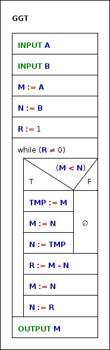

## AuD Übung 2

#### Aufgabe 6

**a)** Ja, denn er ist eindeutig, endlich Beschrieben, allgemein gefasst und ausführbar
**b)**



**c)**

```
read A
read B
M = A
N = B
R = 1
while (R != 0)
 do
	if(M < N)
	 then
		TMP = M
		M = N
		N = TMP
	 end-if
	R = M - N;
	M = N
	N = R
 end-while
print M
```

#### Aufgabe 7

	F(n) = 1 + ( n / (n*2+1) ) * F(n+1)
